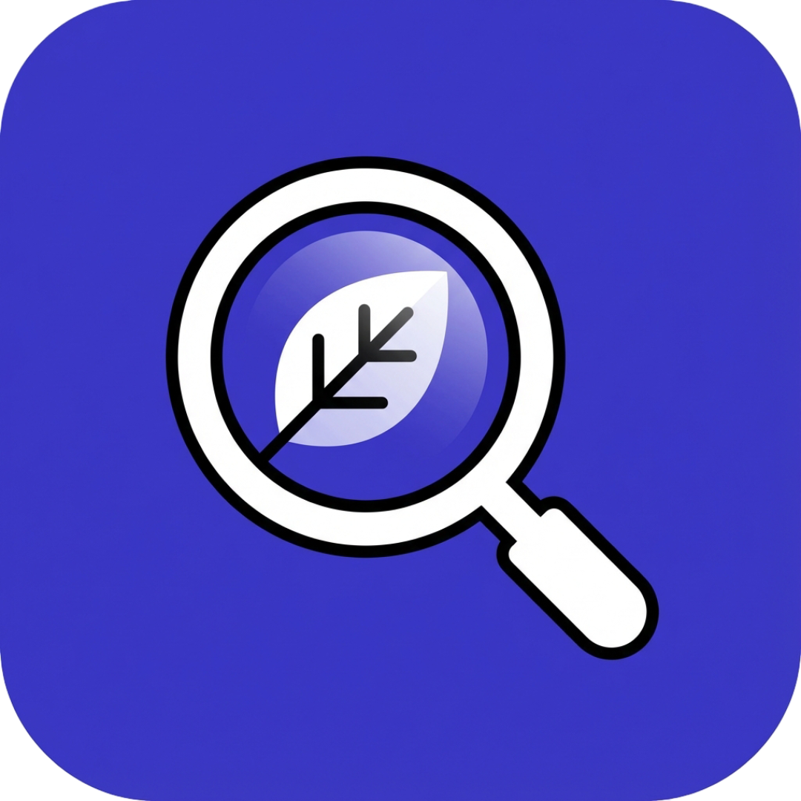
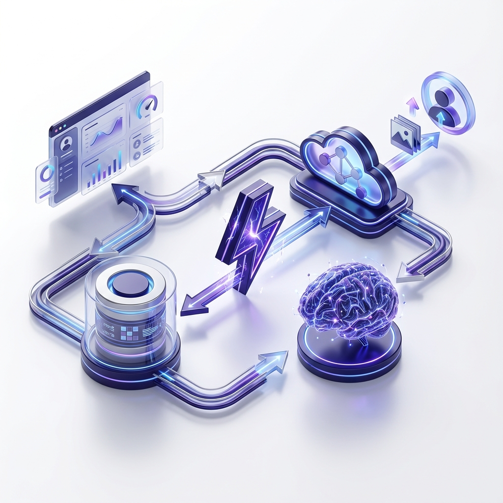

<div align="center">
  
  <h1>LabelLens</h1>
  <p>
    <strong>AI-Native Ingredient Analysis & Reflection Engine</strong>
  </p>
  <p>
    <a href="#overview">Overview</a> •
    <a href="#key-features">Features</a> •
    <a href="#tech-stack">Tech Stack</a> •
    <a href="#getting-started">Getting Started</a> •
    <a href="#project-structure">Structure</a>
  </p>
</div>

<br />

<div align="center">
  
</div>

<br />

## Overview

**LabelLens** redefines how consumers interact with their food. In a world of complex labels and hidden additives, LabelLens serves as a personal "nutrition detective." By leveraging advanced AI (Gemini 2.5 Flash), the application instantly parses ingredient lists into clear, non-judgmental insights, offering a deeper understanding of what we consume without the fear-mongering.

Beyond simple analysis, LabelLens is a **learning platform**. Through gamified quizzes and a personalized progress engine, users build long-term ingredient literacy, turning every scan into a micro-learning opportunity.

## Key Features

### 📸 Smart Scanning
-   **Instant Analysis**: Drag-and-drop any product label image for immediate processing.
-   **Cloud Storage**: Images are securely stored via Firebase Storage for historical reference.

### 🧠 Deep AI Insights
-   **Structured Parsing**: Raw ingredient text is transformed into structured data (What, Why, When).
-   **Contextual explanations**: "Why it's here" and "Long-term effects" explained in plain English.
-   **Visual Cards**: Slick, color-coded UI cards for easy reading.

### 🎮 Interactive Learning
-   **Auto-Quizzes**: Every scan generates a unique, 3-question quiz based on *that specific product*.
-   **Instant Feedback**: Learn by doing with immediate corrections and confetti celebrations.
-   **Knowledge Retention**: Reinforce key takeaways before you leave the page.

### 📈 Progress & Reflection
-   **Personal Dashboard**: Track your scanning history and quiz performance.
-   **AI Reflection Engine**: A dedicated page that uses AI to summarize your journey, identifying patterns in your scans and offering encouragement.
-   **No Scoring**: A non-judgmental approach that prioritizes awareness over grades.

## Tech Stack

This project is built with a modern, type-safe stack designed for performance and developer experience.

-   **Frontend**: [Next.js 16](https://nextjs.org/) (App Router, Server Components)
-   **Styling**: Tailwind CSS, `lucide-react`, `canvas-confetti`
-   **AI Model**: Google Gemini 2.5 Flash (via `@google/generative-ai`)
-   **Database**: Neon (Serverless PostgreSQL)
-   **ORM**: Drizzle ORM
-   **Storage**: Firebase Storage
-   **Auth**: Clerk

## Getting Started

Follow these steps to set up the project locally.

### Prerequisites

-   Node.js 18+
-   npm or pnpm

### Installation

1.  **Clone the repository**
    ```bash
    git clone https://github.com/Vivek-736/LabelLens.git
    cd LabelLens
    ```

2.  **Install dependencies**
    ```bash
    npm install
    # or
    pnpm install
    ```

3.  **Environment Variables**
    Create a `.env.local` file in the root directory and add the following:

    ```env
    # Database
    DATABASE_URL=postgresql://...

    # Auth (Clerk)
    NEXT_PUBLIC_CLERK_PUBLISHABLE_KEY=pk_test_...
    CLERK_SECRET_KEY=sk_test_...

    # AI (Google Gemini)
    GEMINI_API_KEY=AIzaSy...

    # Storage (Firebase)
    NEXT_PUBLIC_FIREBASE_API_KEY=...
    NEXT_PUBLIC_FIREBASE_AUTH_DOMAIN=...
    NEXT_PUBLIC_FIREBASE_PROJECT_ID=...
    NEXT_PUBLIC_FIREBASE_STORAGE_BUCKET=...
    NEXT_PUBLIC_FIREBASE_MESSAGING_SENDER_ID=...
    NEXT_PUBLIC_FIREBASE_APP_ID=...
    ```

4.  **Database Setup**
    Push the schema to your Neon database:
    ```bash
    npx drizzle-kit push
    ```

5.  **Run Development Server**
    ```bash
    npm run dev
    ```

    Open [http://localhost:3000](http://localhost:3000) to view the app.

## Project Structure

```bash
├── app/
│   ├── actions/        # Server Actions (Scan logic)
│   ├── api/            # API Routes (Quiz generation/completion)
│   ├── dashboard/      # Main application routes
│   │   ├── history/    # Scan history grid
│   │   ├── profile/    # User settings
│   │   ├── progress/   # AI reflection page
│   │   └── scan/       # Analysis & Quiz pages
│   └── page.tsx        # Landing page
├── components/
│   ├── fulcrum/        # Custom dashboard components (Sidebar)
│   └── ui/             # Reusable UI components (buttons, input, etc.)
├── config/             # Configuration (DB, Firebase, Schema)
└── public/             # Static assets
```

---

<div align="center">
  <p>Made with passion by Team: <strong>NoCompromise</strong></p>
</div>